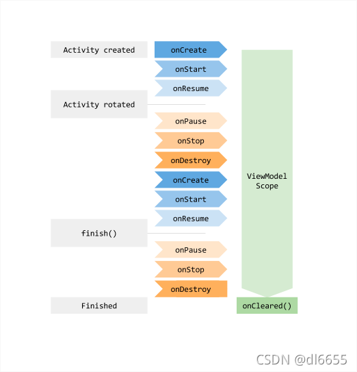

## Activity的进程被杀死后，是如何恢复数据的？

Activity在因为内存不足或其它原因被销毁时，会调用Activity的onSaveInstanceState方法
来保存数据，然后可以通过onCreate或onRestoreInstanceState来恢复数据。保存数据时，调用
onSaveInstanceState方法的入参outState来保存数据，它是一个bundle类型。当Activity回调
onSaveInstanceState方法时，会将outState传递到ActivityClientRecord的state中，之后
会将数据保存在系统服务进程那边，保存在ActivityRecord的icicle里面，由于数据已保存在系统
服务进程那边，所以即使当前Activity所在进程因为资源不足而被杀死，所以之前保存的数据还在，
不会因为进程被杀死而清空。当Activity重新启动时，RootActivityContainer会优先查找已存
在的对应的ActivityRecord，找到后，会按照正常流程启动Activity，保存在icicle的那些数据，
也会跟随LaunchActivityItem一起被带到应用进程中。应用进程接收到此LaunchActivityItem后，
会调用ActivityThread的handleLaunchActivity方法，这个方法需要一个ActivityClientRecord
对象作为参数，所以在调用handleLaunchActivity方法之前，会创建一个ActivityClientRecord对象，
将刚刚传递过来的icicle赋值给ActivityClientRecord的state。handleLaunchActivity方法里面会
调用performLaunchActivity，Activity的onCreate也是在这个方法里面调用的，回调oncreate方法时，
会将ActivityClientRecord的state赋值给onCreate的入参onSaveInstanceState。
handleLaunchActivity执行完毕后，handleStartActivity会被调用，在这里会判断ActivityClientRecord
的state是不是为空，如果不是的话，就回调对应Activity的onRestoreInstanceState方法，整个恢复流程到此结束。
模拟方式：通过开发者模式将`不保留活动`开启，然后将打开应用，按Home键回到桌面。由于`不保留活动`开启，所以该
应用会被杀死。再次点击桌面图标，会重新启动app并直接显示之前关闭的页面。


## LiveData是黏性的吗？
黏性的意思是，先发送，后注册，注册后会接收到之前发送的数据。LiveData是黏性的。LiveData有一个版本号version
初始值为-1，当setValue时，会将将version值加1。当调用LiveData的observe方法时，会将observer通过ObserverWrapper
进行包装，并且ObserverWrapper也有一个版本version，初始值为-1。并且observe注册成功后，会调用dispatchValue方法，
最终会调用considerNotify方法，在该方法中，会比较LiveData的version和ObserverWrapper的version，当ObserverWrapper
的version小于LiveData的version时，就会调用observer的onChanged方法，所以就会造成黏性效果。

LiveData发送数据
```java
    @MainThread
    protected void setValue(T value) {
        assertMainThread("setValue");
        mVersion++;
        mData = value;
        dispatchingValue(null);
    }
```
dispatchingValue
```java
    void dispatchingValue(@Nullable ObserverWrapper initiator) {
        ......
        do {
            mDispatchInvalidated = false;
            if (initiator != null) {
                considerNotify(initiator);
                initiator = null;
            } else {
                for (Iterator<Map.Entry<Observer<? super T>, ObserverWrapper>> iterator =
                        mObservers.iteratorWithAdditions(); iterator.hasNext(); ) {
                    considerNotify(iterator.next().getValue());
                    if (mDispatchInvalidated) {
                        break;
                    }
                }
            }
        } while (mDispatchInvalidated);
        mDispatchingValue = false;
    }
```
considerNotify
```java
    private void considerNotify(ObserverWrapper observer) {
        if (!observer.mActive) {
            return;
        }
        if (!observer.shouldBeActive()) {
            observer.activeStateChanged(false);
            return;
        }
        if (observer.mLastVersion >= mVersion) {
            return;
        }
        observer.mLastVersion = mVersion;
        observer.mObserver.onChanged((T) mData);
    }
```

LiveData的observe方法
```java
    @MainThread
    public void observe(@NonNull LifecycleOwner owner, @NonNull Observer<? super T> observer) {
        ......
        //LifecycleBoundObserver是ObserverWrapper子类
        LifecycleBoundObserver wrapper = new LifecycleBoundObserver(owner, observer);
        ObserverWrapper existing = mObservers.putIfAbsent(observer, wrapper);
        ......
        owner.getLifecycle().addObserver(wrapper);
    }
```

owner.getLifecycle().addObserver(wrapper)这个方法调用的是LifecycleRegistry的addObserver方法，
如下所示：
```java
    @Override
    public void addObserver(@NonNull LifecycleObserver observer) {
        ......
        ObserverWithState statefulObserver = new ObserverWithState(observer, initialState);
        ObserverWithState previous = mObserverMap.putIfAbsent(observer, statefulObserver);
        ......
        while ((statefulObserver.mState.compareTo(targetState) < 0
                && mObserverMap.contains(observer))) {
            ......
            statefulObserver.dispatchEvent(lifecycleOwner, event);
            ......
        }
        ......
    }
```
dispatchEvent方法会调用ObserverWithState的dispatchEvent方法
```java
    void dispatchEvent(LifecycleOwner owner, Event event) {
        ......
        mLifecycleObserver.onStateChanged(owner, event);
        ......
    }
```
mLifecycleObserver实际是LifecycleBoundObserver，所以会调用LifecycleBoundObserver的
onStateChanged方法
```java
    @Override
    public void onStateChanged(LifecycleOwner source, Lifecycle.Event event) {
        if (mOwner.getLifecycle().getCurrentState() == DESTROYED) {
            removeObserver(mObserver);
            return;
        }
        activeStateChanged(shouldBeActive());
    }
```
activeStateChanged
```java
    void activeStateChanged(boolean newActive) {
        ......
        if (mActive) {
            dispatchingValue(this);
        }
    }
```
dispatchingValue调用的就是LiveData的dispatchingValue方法。

模拟：在Activity的onCreate方法中调用observe方法注册观察者，在onResume方法中调用livedata的
setValue方法，查看打印信息。

解决方法：去除粘性

```kotlin
//去除粘性
class SingleLiveData<T> : MutableLiveData<T>() {

    private val mPending by lazy {
        AtomicBoolean()
    }
        
    override fun observe(owner: LifecycleOwner, observer: Observer<in T>) {
        super.observe(owner) {
            if (mPending.compareAndSet(true, false)) {
                observer.onChanged(it)
            }
        }
    }

    override fun setValue(value: T) {
        mPending.set(true)
        super.setValue(value)
    }
}
```

## ViewModel的生命周期

ViewModel的生命周期比Activity和Fragment的生命周期要长

## 当屏幕旋转Activity重建时，ViewModel如何保证页面数据不会重置
一般创建ViewModel对象时，是通过ViewModelProvider(this).get(ViewModel::class.java)
创建。ViewModelProvider的构造函数里会通过owner.getViewModelStore方法来获取ViewModelStore。
在ActivityThread调用performDestroyActivity时，会调用Activity的retainNonConfigurationInstances
方法，该方法会创建一个NonConfigurationInstances对象，并且将Activity的viewModelStore保存在
NonConfigurationInstances对象中，然后将该对象赋值给ActivityThread的NonConfigurationInstances
变量中，这样，ViewModelStore就会保存在系统进程那边。而创建ViewModel时调用getViewModelStore方法会先去
ActivityThread的NonConfigurationInstances中获取ViewModelStore，所以Activity重建时，会拿ViewModel
中保存的数据恢复页面数据。

ActivityThread的performDestroyActivity方法
```java
    ActivityClientRecord performDestroyActivity(IBinder token, boolean finishing,
            int configChanges, boolean getNonConfigInstance, String reason) {
        ......
            if (getNonConfigInstance) {
                try {
                    r.lastNonConfigurationInstances
                            = r.activity.retainNonConfigurationInstances();
                } catch (Exception e) {
        ......
                }
            }
        ......
        }
        ......
    }
```
Activity的retainNonConfigurationInstances方法
```java
    NonConfigurationInstances retainNonConfigurationInstances() {
        Object activity = onRetainNonConfigurationInstance();
        ......

        NonConfigurationInstances nci = new NonConfigurationInstances();
        nci.activity = activity;
        ......
        return nci;
    }
```
ComponentActivity的onRetainNonConfigurationInstance方法
```java
    public final Object onRetainNonConfigurationInstance() {
        Object custom = onRetainCustomNonConfigurationInstance();

        ViewModelStore viewModelStore = mViewModelStore;
        if (viewModelStore == null) {
            // No one called getViewModelStore(), so see if there was an existing
            // ViewModelStore from our last NonConfigurationInstance
            NonConfigurationInstances nc =
                    (NonConfigurationInstances) getLastNonConfigurationInstance();
            if (nc != null) {
                viewModelStore = nc.viewModelStore;
            }
        }

        if (viewModelStore == null && custom == null) {
            return null;
        }

        NonConfigurationInstances nci = new NonConfigurationInstances();
        nci.custom = custom;
        nci.viewModelStore = viewModelStore;
        return nci;
    }
```
所以，Activity调用onDestroy方法时，会将Activity的viewModelStore保存在ActivityThread
中。

ViewModelProvider的构造方法
```java
    public ViewModelProvider(@NonNull ViewModelStoreOwner owner) {
        this(owner.getViewModelStore(), owner instanceof HasDefaultViewModelProviderFactory
                ? ((HasDefaultViewModelProviderFactory) owner).getDefaultViewModelProviderFactory()
                : NewInstanceFactory.getInstance());
    }
```
ComponentActivity的getViewModelStore方法
```java
    public ViewModelStore getViewModelStore() {
        if (getApplication() == null) {
            throw new IllegalStateException("Your activity is not yet attached to the "
                    + "Application instance. You can't request ViewModel before onCreate call.");
        }
        ensureViewModelStore();
        return mViewModelStore;
    }
```
ComponentActivity的ensureViewModelStore方法
```java
    void ensureViewModelStore() {
        if (mViewModelStore == null) {
            NonConfigurationInstances nc =
                    (NonConfigurationInstances) getLastNonConfigurationInstance();
            if (nc != null) {
                // Restore the ViewModelStore from NonConfigurationInstances
                mViewModelStore = nc.viewModelStore;
            }
            if (mViewModelStore == null) {
                mViewModelStore = new ViewModelStore();
            }
        }
    }
```
getLastNonConfigurationInstance方法
```java
    public Object getLastNonConfigurationInstance() {
        return mLastNonConfigurationInstances != null
                ? mLastNonConfigurationInstances.activity : null;
    }
```
mLastNonConfigurationInstances来自哪里呢？看看赋值的地方，如下所示Activity的attach方法：
```java
    final void attach(Context context, ActivityThread aThread,
            Instrumentation instr, IBinder token, int ident,
            Application application, Intent intent, ActivityInfo info,
            CharSequence title, Activity parent, String id,
            NonConfigurationInstances lastNonConfigurationInstances,
            Configuration config, String referrer, IVoiceInteractor voiceInteractor,
            Window window, ActivityConfigCallback activityConfigCallback, IBinder assistToken,
            IBinder shareableActivityToken) {
        ......
        mLastNonConfigurationInstances = lastNonConfigurationInstances;
        ......
    }
```
当ActivityThread调用performLaunchActivity时会调用Activity的attach方法，如下所示
```java
    private Activity performLaunchActivity(ActivityClientRecord r, Intent customIntent) {
        ......
                activity.attach(appContext, this, getInstrumentation(), r.token,
                        r.ident, app, r.intent, r.activityInfo, title, r.parent,
                        r.embeddedID, r.lastNonConfigurationInstances, config,
                        r.referrer, r.voiceInteractor, window, r.configCallback,
                        r.assistToken);

        ......
    }
```
所以lastNonConfigurationInstances来自ActivityClientRecord。


## startActivity看android启动流程
Activity.startActivity->Activity.startActivityForResult
->Instrumentation.execStartActivity->ActivityTaskManagerService.startActivity
->ActivityTaskManagerService.startActivityAsUser->ActivityStarter.execute
->ActivityStarter.executeRequest->ActivityStarter.startActivityUnchecked
->ActivityStarter.startActivityInner->RootWindowContainer.resumeFocusedStacksTopActivities
->ActivityStack.resumeTopActivityUncheckedLocked->ActivityStack.resumeTopActivityInnerLocked
->ActivityStackSupervisor.startSpecificActivity->ActivityStackSupervisor.realStartActivityLocked
->ClientLifecycleManager.scheduleTransaction->ClientTransaction.schedule->ApplicationThread.scheduleTransaction
->ApplicationThread.scheduleTransaction->ClientTransactionHandler.scheduleTransaction
->ActivityThread.H(EXECUTE_TRANSACTION)->TransactionExecutor.execute
->TransactionExecutor.executeCallbacks->LaunchActivityItem.execute
->ActivityThread.handleLaunchActivity->ActivityThread.performLaunchActivity
（分支一）->Instrumentation.callActivityOnCreate->Activity.performCreate
（分支二）->Instrumentation.newActivity


